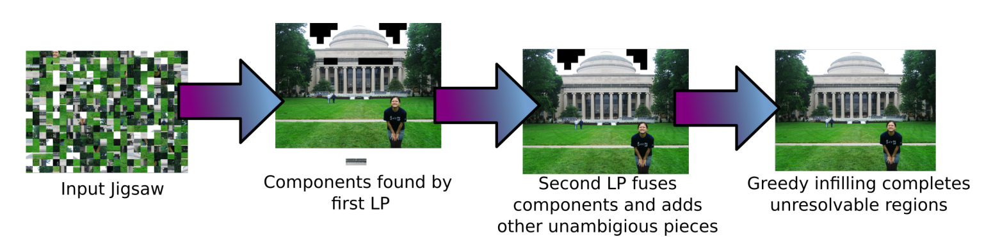

# JigSaw-Puzzle

Jigsaw Puzzle Solver¶

Solving jigsaw puzzles computationally remains a relevant and intriguing problem noted for its applications to real-world problems.

In this problem, you'll implement a solver that solves jigsaw puzzles using linear programming.

The current problem requires you to only solve Type I problems (i.e. problems where the orientation of the pieces is known).

You may refer to this paper Solving Jigsaw Puzzles with Linear Programming[!jigsaw.pdf] for implementation details.

